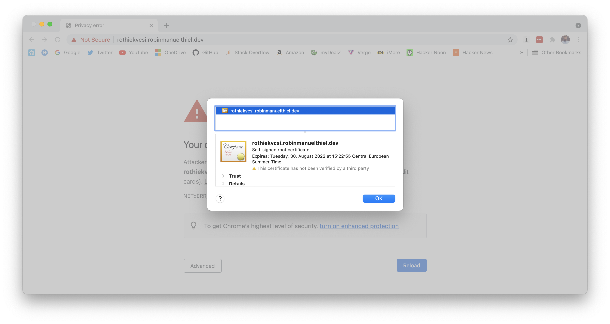

# Azure KeyVault CSI Driver

This demo uses the Azure KeyVault CSI Driver for Kubernetes to demonstrate the following:

- Authenticate against Azure KeyVault using AAD Pod Identity
- Mount a Secret into a Pod
- Use a self-signed certifcate for an NGINX ingress controller

## Get it running

Login to your Azure Account.

```bash
az login
```

Setup the infrastructure with Terraform from the `/terraform` folder.

```bash
terraform init

terraform apply -auto-approve
```

> ***Note:*** Installing the NGINX Helm Chart via Terraform will fail the first time, as the `SecretProviderClass` isn't availabe at this point in time. That's ok, we will fix it later.

Get the Ingress IP Address from the Terraform output and create a DNS A-Record at your Domain pointing to domain of your choice. In this demo, it is `rothiekvcsi.robinmanuelthiel.dev`. If you choose a different one, adjust it in `kubernetes/ingress.yaml`.

Login to the cluster

```bash
az aks get-credentials -g <RESOURCE_GROUP> -n <CLUSTER_NAME>
```

Set Pod Security Policies according to the [Azure KeyVault CSI Driver documentation](https://azure.github.io/secrets-store-csi-driver-provider-azure/getting-started/installation/#using-deployment-yamls).

```bash
kubectl apply -f https://raw.githubusercontent.com/Azure/secrets-store-csi-driver-provider-azure/master/deployment/pod-security-policy.yaml
```

Setup the Kubernetes Cluster from the `/kubernetes` folder.

```bash
kubectl apply -f .
```

Run Terraform again to fix the NGINX Helm Chart.

```bash
terraform apply -auto-approve
```


