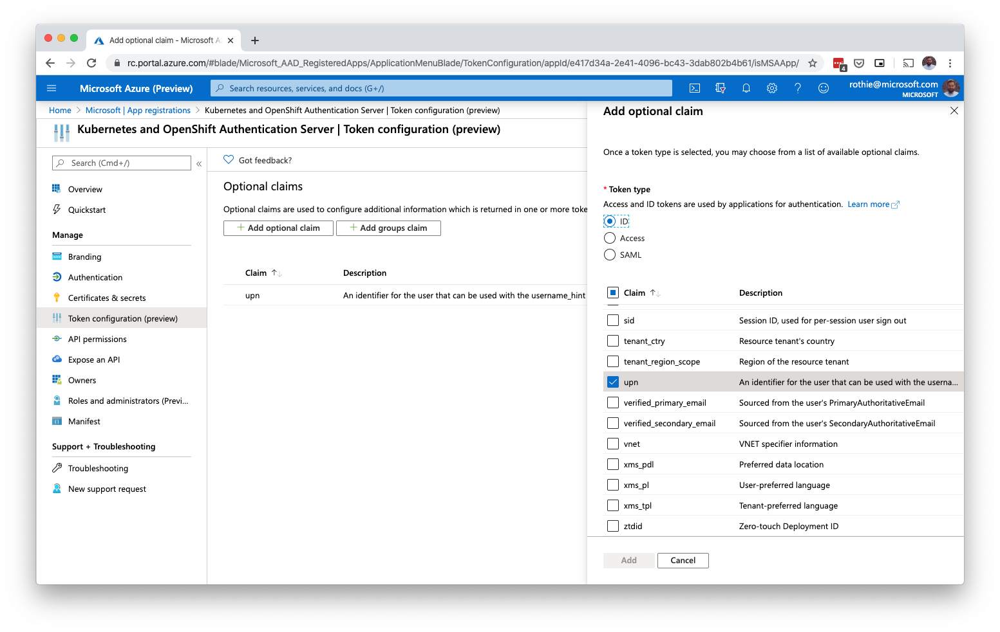
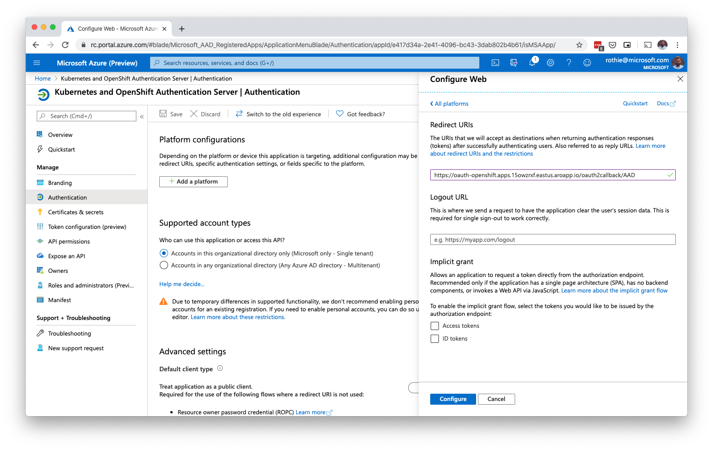
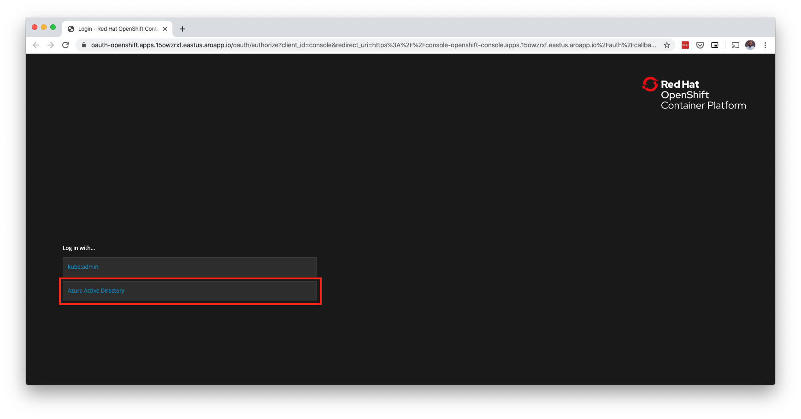

# Azure Active Directory Authentication

## 1. Configure your Active Directory Application Registration

You can either use the same App registration for Azure Active Directory Authentication, that you used for creating the cluster or create a new one, if you want to use a different Azure Active Directory Tenant for example.

### Add an UPN claim

To ensure, that both, native Azure Active Directory users and B2B users can login at Open Shift, we need to enforce, that everyone has a unique identifier.

1. Open the App registration
1. Click on ***Token configuration***
1. Click on ***Add optional claim***
1. Select ***ID*** 
1. Select ***upn*** from the claims list.
1. Click the ***Add*** button



### Add a Redirect URI

For OAuth, a redirect URI to the cluster has to be added to the App registration, which follows the following scheme.

```
https://oauth-openshift.apps.<YOUR_CLUSER_DOMAIN>/oauth2callback/<OAUTH_PROVIDER_NAME>
```

So for Azure Active Directory in Azure Red Hat OpenShift, it could look like this:

```
https://oauth-openshift.apps.15owzrxf.eastus.aroapp.io/oauth2callback/Azure%20Active%20Directory
```

To add the redirect URI, follow the following steps:

1. Open the App registration
1. Click on ***Authentication***
1. Click on ***Add a platform***
1. Select ***Web*** 
1. Enter your redirect URI.
1. Click the ***Configure*** button



Alternatively, you can also use the command line.

```bash
az ad app update --id <CLIENT_ID> --reply-urls <REDIRECT_URL>
```

## 2. Create an OpenShift secret for the Service Principal Secret

```bash
oc create secret generic openid-client-secret-aad \
    --from-literal=clientSecret=<YOUR_CLIENT_SECRET> \
    --namespace openshift-config
```

## 3. Add the OpenID Connect configuration to your cluster

Create a new configuration file for the OAuth configuration `aad.yaml` and replace the placeholders with your values.

```yaml
apiVersion: config.openshift.io/v1
kind: OAuth
metadata:
  name: cluster
spec:
  identityProviders:
  - name: Azure Active Directory
    mappingMethod: claim
    type: OpenID
    openID:
      clientID: <YOUR_CLIENT_ID>
      clientSecret: 
        name: openid-client-secret-aad 
      extraScopes: 
      - email
      - profile
      extraAuthorizeParameters: 
        include_granted_scopes: "true"
      claims:
        preferredUsername: 
        - email
        - upn
        name: 
        - name
        email: 
        - email
      issuer: https://login.microsoftonline.com/<YOUR_TENANT_ID>
```

Apply the configuration to your cluster.

```bash
oc apply -f aad.yaml
```

## 5. Login with Azure Active Directory

Return to your Azure Red Hat OpenShift console and log out of your admin account, if you are still logged in. You should now see a new Login button for Azure Active Directory.



> **Note:** If you don't see the new Login button, make sure to clear the Browser Cache and Cookies or try in Private Mode.
